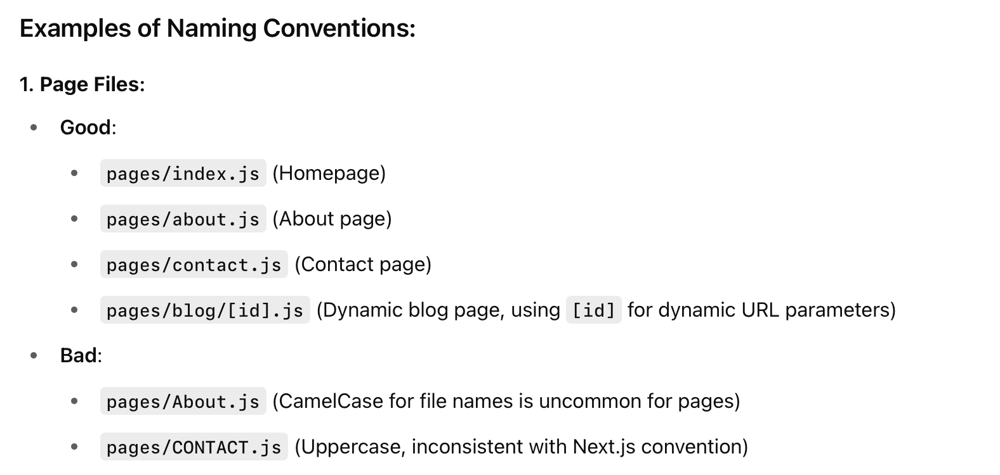
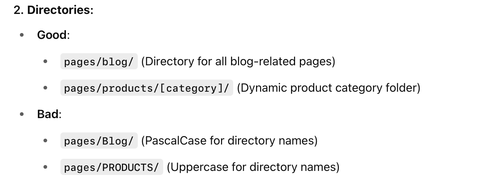
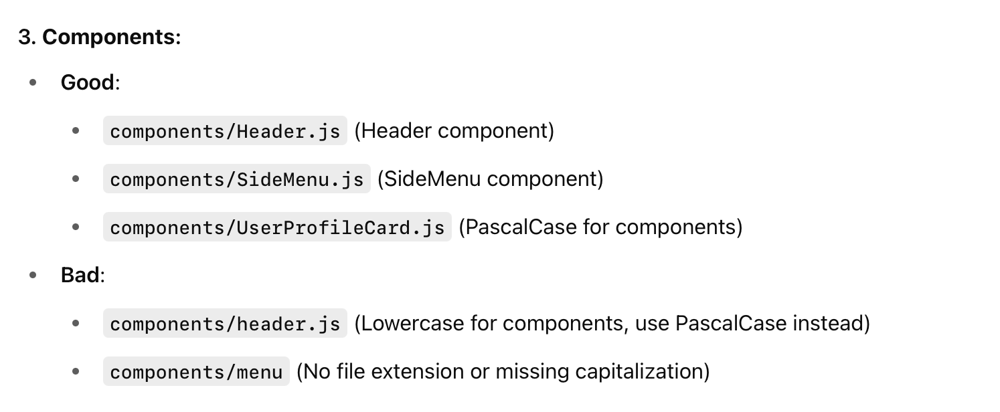
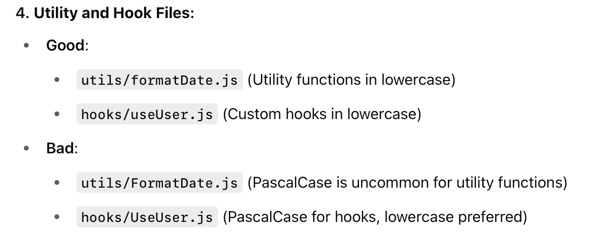

In Next.js, the casing convention for naming directories and pages is important for both consistency and SEO purposes, and follows a few key principles:

### Page Files (.js, .jsx, .ts, .tsx):
CamelCase or PascalCase is generally preferred for page names.
Lowercase is commonly used for dynamic routes.

### Directory Naming:
Lowercase: Directory names in Next.js are typically lowercase. This aligns with both Unix-based systems (which are case-sensitive) and URL convention.
Hyphenated (kebab-case): For multiple words, hyphenated (kebab-case) is used in directory and file names. This helps maintain consistency and improves readability.

### Dynamic Routes:
Square Brackets ([ ]): When using dynamic routes (e.g., /post/[id]), you should use lowercase for the folder names and include dynamic route parameters inside square brackets.

### Components, Functions, and Utility Files:
PascalCase or CamelCase is typically used for React components, while lowercase is used for non-component files like utility functions, hooks, etc.

## Why These Conventions Matter:
Consistency: Lowercase directories and files are consistent and avoid potential issues with case-sensitivity in different environments (e.g., deployment on Linux).
SEO & URLs: Next.js pages are based on the file system, and the way you name your pages directly impacts your URL structure. Using lowercase and hyphenated names (e.g., /blog-post) is more SEO-friendly compared to uppercase or camel case URLs (e.g., /BlogPost).
Best Practices: These conventions follow industry best practices and are widely accepted, ensuring that developers and teams can maintain clean, readable, and consistent codebases.
Final Summary:
Page files: lowercase.js or kebab-case.js (for multiple words).
Directories: lowercase or kebab-case for better consistency across systems.
Components: PascalCase for React components.
Utility and hook files: camelCase or lowercase.
This structure makes it easier to maintain consistency, improve SEO, and avoid issues in case-sensitive systems, especially when working with dynamic routes and Next.js’s file-based routing.